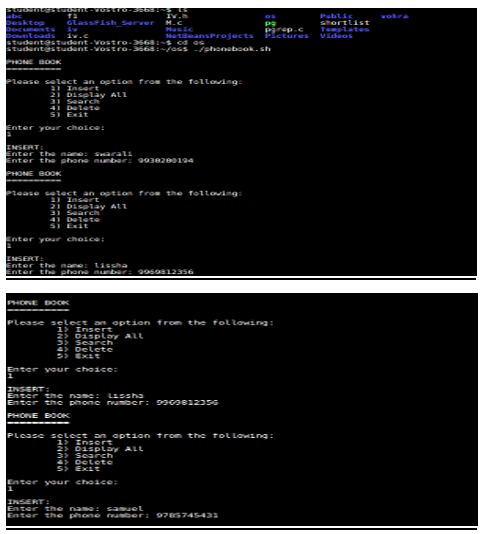
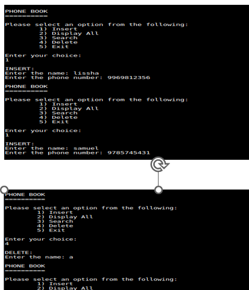
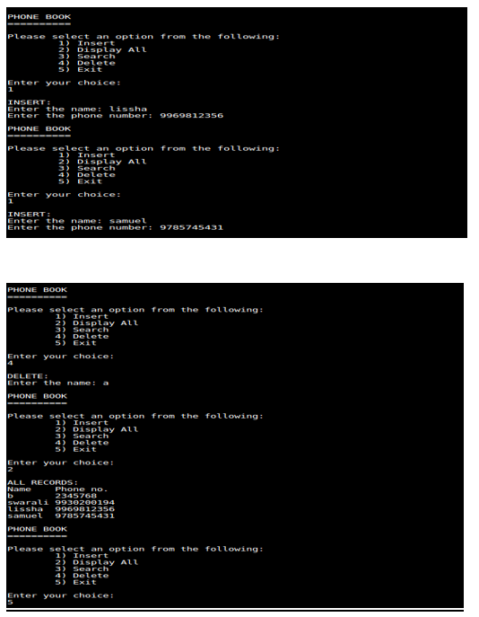

### 📞 Phonebook Management System in Shell Script  

### 📌 Introduction  
The **Phonebook Management System** is a simple and efficient Shell Script that allows users to **store, search, update, and delete contacts** from a phonebook file. It provides a command-line interface for managing contact details with ease.  

### 🎯 Objective  
The primary goal of this project is to implement a **lightweight, user-friendly, and efficient** phonebook system using **Shell Scripting**, demonstrating strong scripting skills and file-handling capabilities.

### 🚀 Features  
✔️ **Add Contact** – Save a person's name and phone number.  
✔️ **Search Contact** – Find a contact by name or number.  
✔️ **Update Contact** – Modify an existing contact's details.  
✔️ **Delete Contact** – Remove unwanted contacts.  
✔️ **View All Contacts** – Display the entire contact list in a structured format. 

### 🏗️ Technologies Used  
- Programming Language: **Shell Scripting**  
- OS: **Linux**  
- User Interface: **Command-line Interface (CLI)**
  

### 📝 Proposed System  
This project utilizes:  
- **Bash Shell Scripting** for execution.  
- **File Handling** to store contacts persistently.  
- **User-friendly Menu-driven Interface** for interaction.  

### 🔲 Block Diagram  
```
+------------------+
|  Main Menu       |
+------------------+
+------------------+
|  Add Contact    |
|  Search Contact |
|  Update Contact |
|  Delete Contact |
|  View Contacts  |
|  Exit           |
+------------------+
```

### 📸 Screenshots  

# 
# 
# 


### 🛠️ Future Improvements  
🔹 Implement a **GUI version** using `Zenity` or `Dialog`.  
🔹 Integrate **CSV format storage** for better data handling.  
🔹 Add **backup & restore functionality**.  
🔹 Implement **import/export contacts** from other formats. 

### 📌 Why This Project?  
This project highlights **Shell Scripting expertise**, **file handling skills**, and **problem-solving abilities**—key competencies for DevOps, Automation, and System Administration roles.  

Feel free to connect if you have questions or suggestions for improving this dashboard! 
## 📫 Let's Connect  
- **LinkedIn**: [Swarali U. Gaonkar](https://www.linkedin.com/in/swaraligaonkar/)  
- **GitHub**: [swaraligk](https://github.com/swaraligk)  
- **Email**: swaraligk16@gmail.com
  
